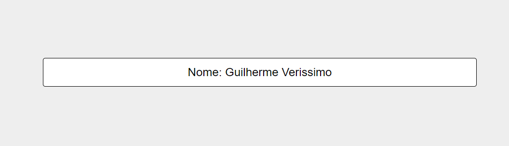

# Projeto-Intermediário-JavaScritp-01
O Projeto aqui é do nível <b>Intermediário</b>, utilizando HTML/CSS e JavaScritp

 
    
    
              

#

#01 Exiba Seu Nome Na Tela

O Scritp irar utilizar a função (prompt) para receber uma <b>String</b> do user e exibir o <b>nome</b> dele na tela, nesse Scritp foi utilizado:

- variaveis
- id
- prompt()

#

    

